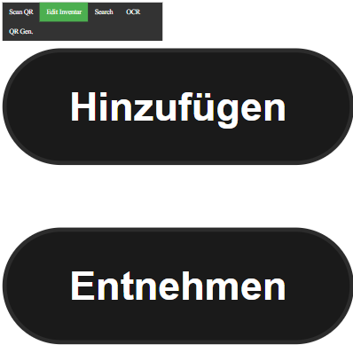

# just_another_inventory_manager
The purpose of the application is to have a simple application that shows you the existing inventory.

It is designed as an Web App that should be only available over the local network! Their will be no safety measurments in this application!

You will need to place QR Codes (the represent the id of the item) where you can scan them. The worker who will take items from your inventory have to connect to your local network and open the link from the QR Code
, then the can select if the remove or add any of them and how much.

Install :

git clone https://github.com/Wiffzack/just_another_inventory_manager.git

node 19.7.0 (recommend nvm)

npm install --force

Database:

MongoDB (make sure it is accessable from the network )

